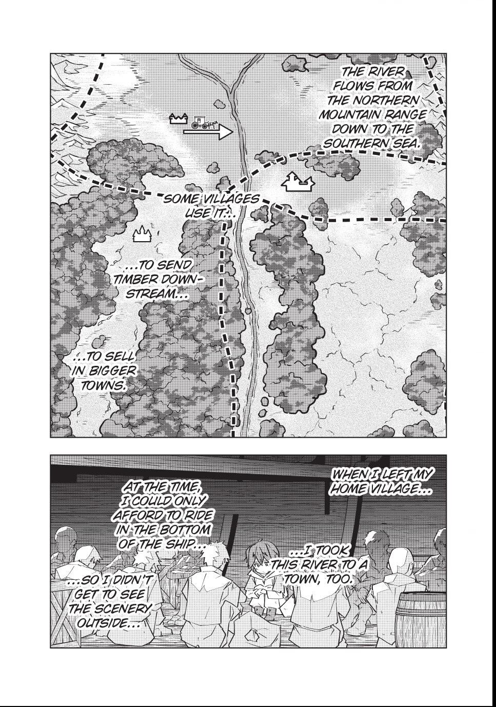
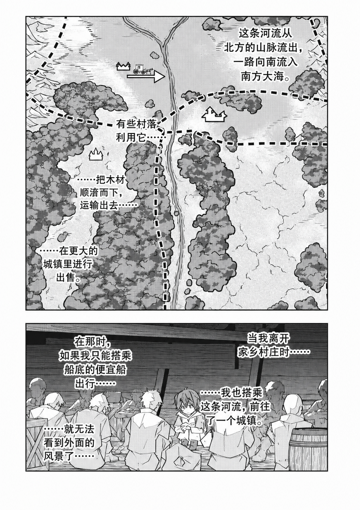

# Translate Manga Codex Plugin

This repository is a Codex plugin marketplace for the `translate-manga` skill.

## Install

Add this repository as a plugin marketplace:

- Source: `fenghengzhi/manga-translate-skill` or `https://github.com/fenghengzhi/manga-translate-skill.git`
- Sparse path: leave empty

Then install the plugin:

```bash
codex plugin marketplace add fenghengzhi/manga-translate-skill
codex plugin add translate-manga@translate-manga
```

Start a new Codex thread after installation so the skill is loaded.

## Contents

- `.agents/plugins/marketplace.json`: Marketplace entry for Codex.
- `plugins/translate-manga/.codex-plugin/plugin.json`: Plugin manifest.
- `plugins/translate-manga/skills/translate-manga/SKILL.md`: Skill workflow instructions.
- `plugins/translate-manga/skills/translate-manga/scripts/validate_outputs.py`: Output validation helper.

## What The Skill Does

The skill defines a manga translation workflow for `image_gen.imagegen`:

- Use one fresh subagent for each generated manga page.
- Pass the source page as a `local_image`, not only as a filesystem path in text.
- Preserve panels, characters, black-and-white line art, halftones, and page structure.
- Replace visible original text with natural Simplified Chinese.
- Save outputs as deterministic files such as `002.zh.png`.
- Validate generated files with `skills/translate-manga/scripts/validate_outputs.py`.

## Translation Example

| Original | Translated |
| --- | --- |
|  |  |

## Usage Examples

```text
$translate-manga translate all images in ./chapter-01 and save each output as <basename>.zh.png.
$translate-manga translate pages 001-022 in ./chapter-01.
$translate-manga re-translate ./chapter-01/005.jpg and overwrite ./chapter-01/005.zh.png.
$translate-manga translate all hash-named images in ./chapter-01 while keeping each original basename.
$translate-manga validate translated outputs in ./chapter-01.
```

## Notes

This skill is designed specifically for Codex. It relies on Codex-provided image generation and subagent isolation, especially the ability to pass each source page as a `local_image` and call `image_gen.imagegen` from a fresh context.

Translated images may come back with slight expansion, trimming, or dimension drift compared with the original page. The workflow can detect and optionally resample dimensions, but it does not currently have a reliable way to prevent these image-generation changes at the source.

## Local Validation

```bash
python3 /path/to/plugin-creator/scripts/validate_plugin.py plugins/translate-manga
python3 /path/to/skill-creator/scripts/quick_validate.py plugins/translate-manga/skills/translate-manga
```
